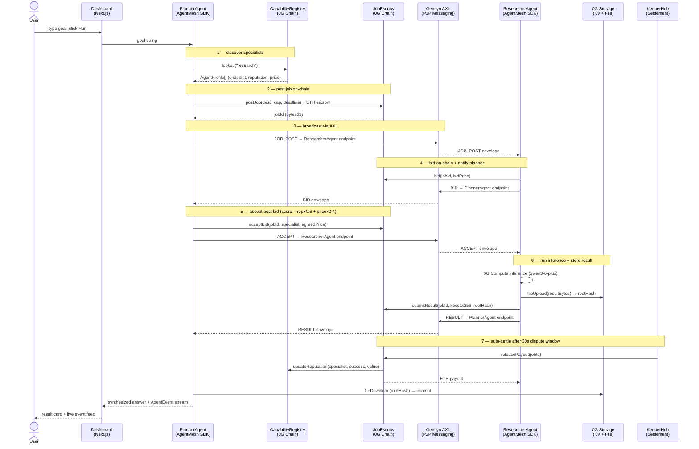
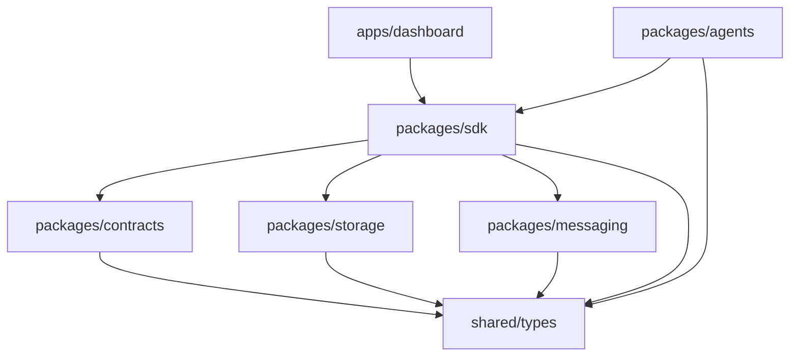
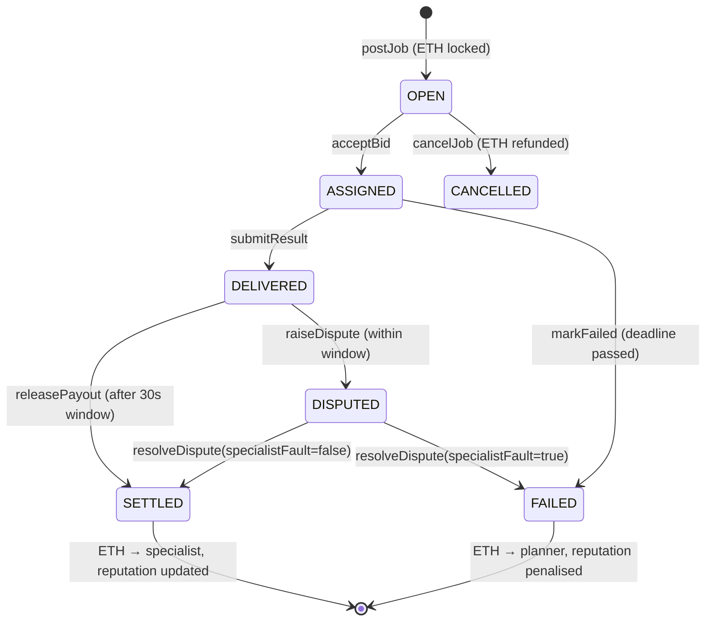

# AgentMesh Architecture

```mermaid
sequenceDiagram
    actor User
    participant Dashboard as Dashboard<br/>(Next.js)
    participant Planner as PlannerAgent<br/>(AgentMesh SDK)
    participant Registry as CapabilityRegistry<br/>(0G Chain)
    participant Escrow as JobEscrow<br/>(0G Chain)
    participant AXL as Gensyn AXL<br/>(P2P Messaging)
    participant Researcher as ResearcherAgent<br/>(AgentMesh SDK)
    participant Storage as 0G Storage<br/>(KV + File)
    participant Keeper as KeeperHub<br/>(Settlement)

    User->>Dashboard: type goal, click Run
    Dashboard->>Planner: goal string

    Note over Planner,Registry: 1 — discover specialists
    Planner->>Registry: lookup("research")
    Registry-->>Planner: AgentProfile[] (endpoint, reputation, price)

    Note over Planner,Escrow: 2 — post job on-chain
    Planner->>Escrow: postJob(desc, cap, deadline) + ETH escrow
    Escrow-->>Planner: jobId (bytes32)

    Note over Planner,AXL: 3 — broadcast via AXL
    Planner->>AXL: JOB_POST → ResearcherAgent endpoint
    AXL-->>Researcher: JOB_POST envelope

    Note over Researcher,Escrow: 4 — bid on-chain + notify planner
    Researcher->>Escrow: bid(jobId, bidPrice)
    Researcher->>AXL: BID → PlannerAgent endpoint
    AXL-->>Planner: BID envelope

    Note over Planner,Escrow: 5 — accept best bid (score = rep×0.6 + price×0.4)
    Planner->>Escrow: acceptBid(jobId, specialist, agreedPrice)
    Planner->>AXL: ACCEPT → ResearcherAgent endpoint
    AXL-->>Researcher: ACCEPT envelope

    Note over Researcher,Storage: 6 — run inference + store result
    Researcher->>Researcher: 0G Compute inference (qwen3-6-plus)
    Researcher->>Storage: fileUpload(resultBytes) → rootHash
    Researcher->>Escrow: submitResult(jobId, keccak256, rootHash)
    Researcher->>AXL: RESULT → PlannerAgent endpoint
    AXL-->>Planner: RESULT envelope

    Note over Keeper,Escrow: 7 — auto-settle after 30s dispute window
    Keeper->>Escrow: releasePayout(jobId)
    Escrow->>Registry: updateReputation(specialist, success, value)
    Escrow-->>Researcher: ETH payout

    Planner->>Storage: fileDownload(rootHash) → content
    Planner-->>Dashboard: synthesized answer + AgentEvent stream
    Dashboard-->>User: result card + live event feed
```

## Package dependency graph

```mermaid
graph TD
    A[apps/dashboard] --> B[packages/sdk]
    C[packages/agents] --> B
    B --> D[packages/contracts]
    B --> E[packages/storage]
    B --> F[packages/messaging]
    D --> G[shared/types]
    E --> G
    F --> G
    B --> G
    C --> G
```

## On-chain state machine

```mermaid
stateDiagram-v2
    [*] --> OPEN: postJob (ETH locked)
    OPEN --> ASSIGNED: acceptBid
    OPEN --> CANCELLED: cancelJob (ETH refunded)
    ASSIGNED --> DELIVERED: submitResult
    ASSIGNED --> FAILED: markFailed (deadline passed)
    DELIVERED --> SETTLED: releasePayout (after 30s window)
    DELIVERED --> DISPUTED: raiseDispute (within window)
    DISPUTED --> SETTLED: resolveDispute(specialistFault=false)
    DISPUTED --> FAILED: resolveDispute(specialistFault=true)
    SETTLED --> [*]: ETH → specialist, reputation updated
    FAILED --> [*]: ETH → planner, reputation penalised
```
